# Algorithm Visualizer

 

An algorithm visualizer app, built with react to visualize sorting and pathfinding algorithms

## Overview

The app has a simple interface where users can perform sorting and pathfinding visualizations.
For pathfinding, one can build walls, move around the start and end nodes, choose algorithms from the hover drop down and visualize the selected algorithm with the Visualize algorithm button. The algorithms will avoid the walls and try to reach the end node from the start node in the shortest path possible.
Similarly for sorting, one can choose array length, particular sorting algorithm and visualizse it.

This project was bootstrapped with [Create React App](https://github.com/facebook/create-react-app).

## [Live DEMO](https://shucoll.github.io/AlogVisualize/)

## Installation and Usage

First clone the repo

```sh
git clone https://github.com/shucoll/AlogVisualize
```

Install the dependencies

```sh
npm install
```

Runs the app in the development mode.
Open http://localhost:3000 to view it in the browser.

```sh
npm start
```

Create a production build

```sh
npm run build
```

You can then deploy the app with github pages or any other hosting platform.

## Examples

Homepage
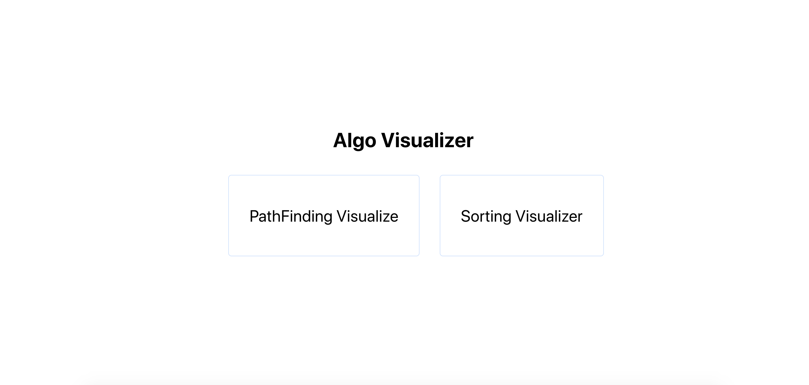

### PathFinding

Interface
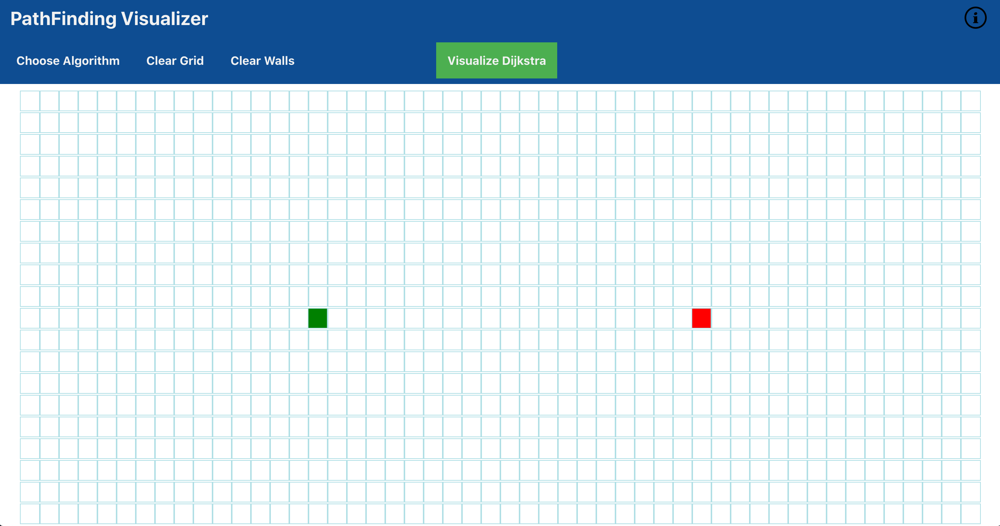

Dropdown to select algorithms
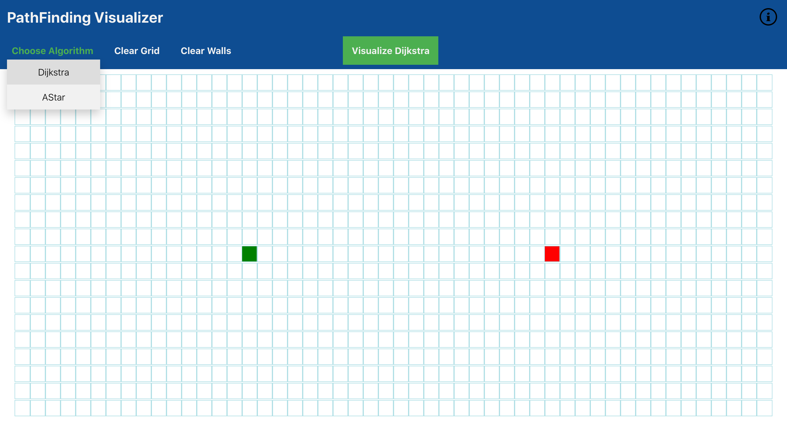

Creating walls with click and drag
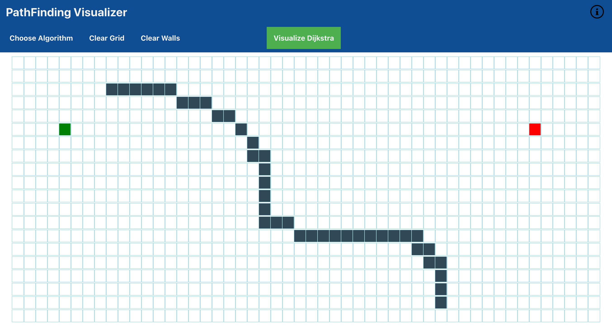

Visualizing the selected algorithm
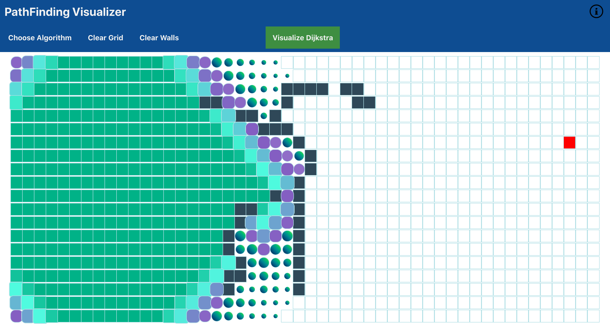

Generated shortest path after visualization
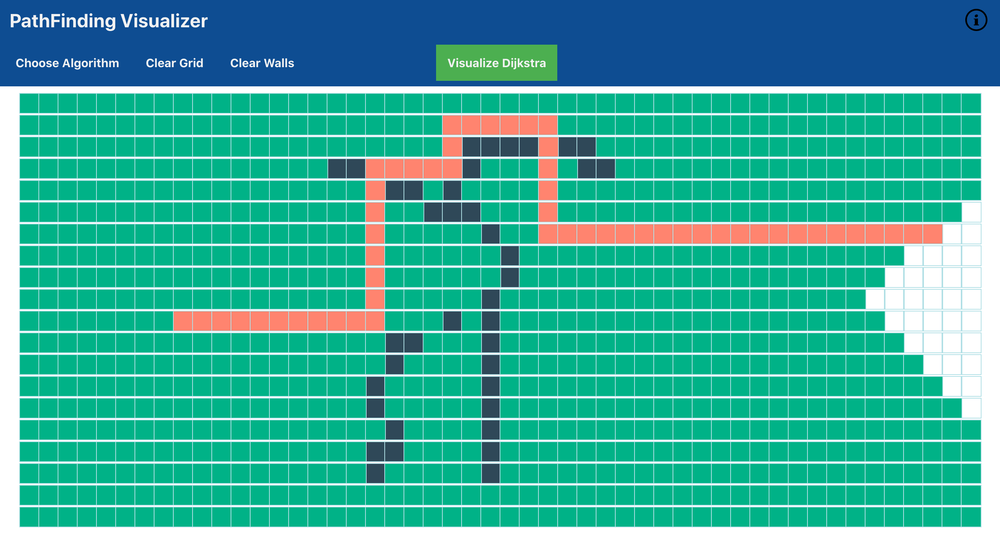

### Sorting

Interface
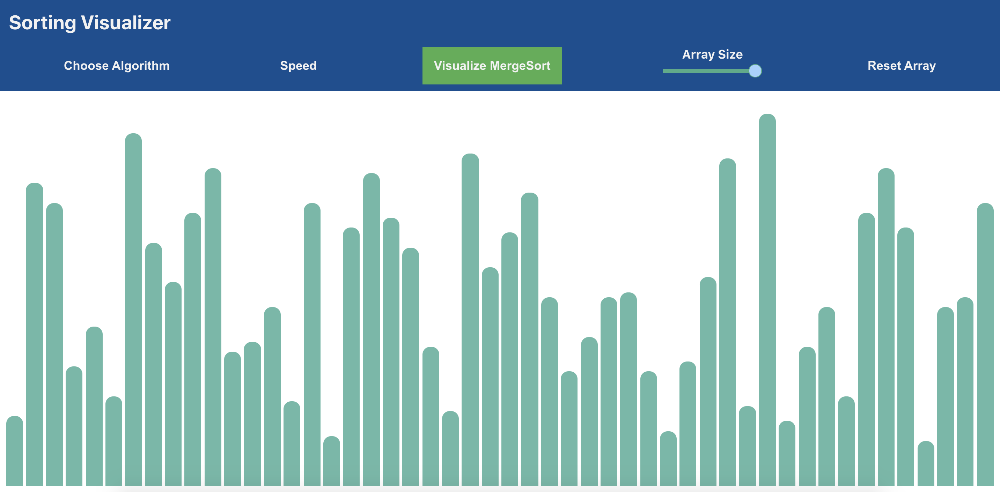

Dropdown to select algorithms
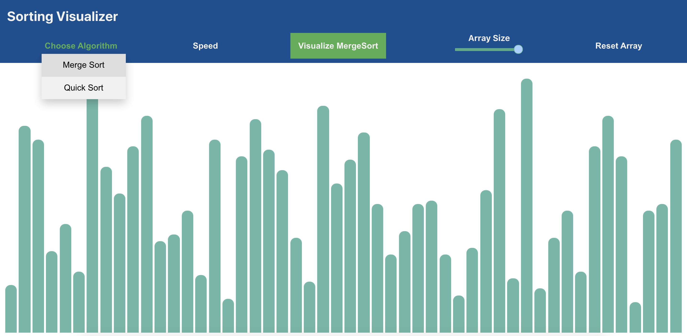

Change array length
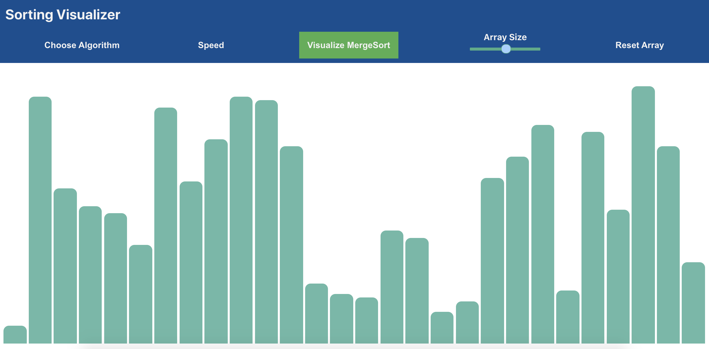

Visualizing the selected algorithm
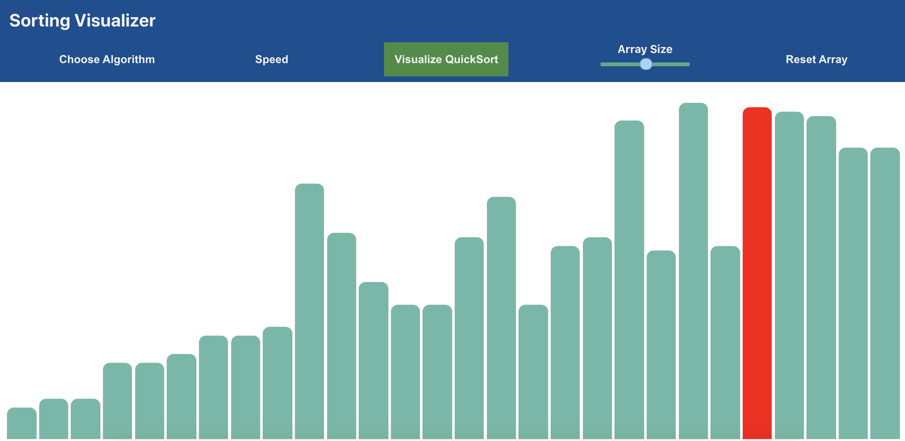

Array in sorted form
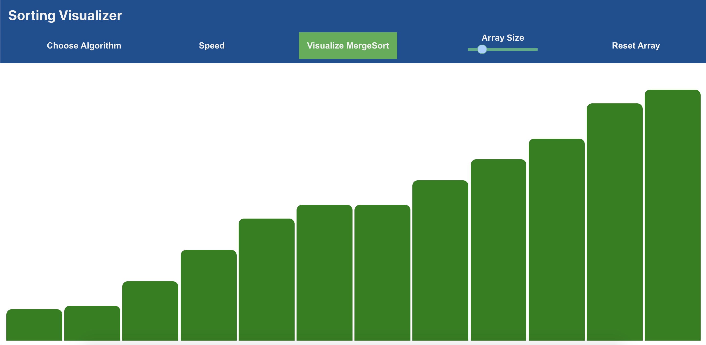

## References

[Medium post](https://medium.com/@prudhvi.gnv/path-finding-visualizer-using-react-from-creating-to-building-and-deploying-bd1e2bc64696)
https://github.com/clementmihailescu/Pathfinding-Visualizer-Tutorial
https://github.com/clementmihailescu/Sorting-Visualizer-Tutorial
